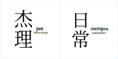

# JieLi STUFF

**JieLi Technology - Chips Delight the World.**

## Who is the JieLi?

JieLi (杰理) "JL"/"Jerry" was based in 2010 in the ZhuHai city of Guangdong, China.

Their chips can be found in various cheap MP3 players, Bluetooth speakers, Bluetooth/MP3 modules,
dash cams, etc.

If not them, then maybe from some other companies like Buildwin/Appotech, Actions Semi, Bluetrum, RDA, Beken...

The chips can be identified by them having an slanted "JL"/"π" logo,
and the "nonsense" markings like "AB1526CG3X1F.1-82E", "AC1631097294-04A", etc.

## Contents

- [Chips](chips/index.md) - Information about chips
- [Boards and devices](boards/index.md) - Information about some boards and devices
- [IP blocks](ip/index.md) - Information about the IP blocks
- [CPU cores](cpu/index.md) - Information about the CPU cores
- [Misc info](misc/index.md) - Various information that doesn't really belong to any category...
- [Special links](specilinks.md)

-------------------------------------

