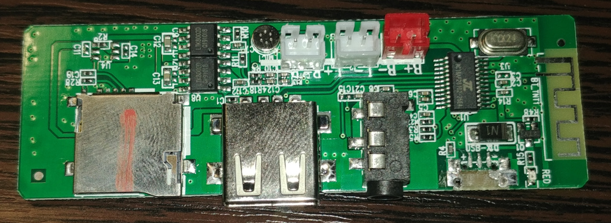
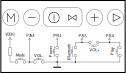

# HF9234-25E-V2

**I don't have this thing anymore because it wasn't mine at all.**
**What i was supposed to do is to replace an microusb port for charging, that's all.**
**But of course i didn't miss an opportunity to do some stuff with it.**
**Of course i also messed with its flash, and of course did dump it to restore it back.**

A board from some blue JBL-ish speaker/boombox.

- MCU: AC6925E

## Pin usage

|    Pin    |             Usage              |
|-----------|--------------------------------|
| PR1       | Power button                   |
| PR2       | Amplifier shutdown             |
| PA0       | Microphone                     |
| PA3       | AUX in                         |
| PA4       | Keys1                          |
| PB0       | Onboard LEDs (half of them)    |
| PB4       | Keys2                          |
| PB5       | Keys3                          |
| PC5       | SD card CLK                    |
| PC4       | SD card CMD                    |
| USBDM/PC3 | SD card DAT0, USB D-           |
| USBDP     | USB D+                         |

Keys are connected as follows:

