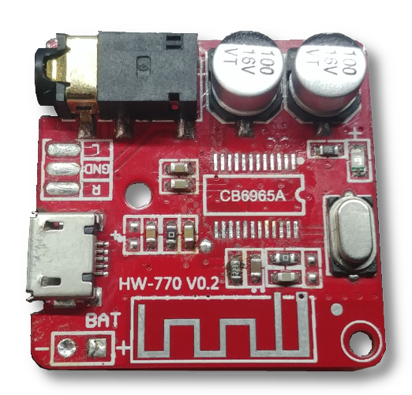

# HW-770 V0.2

Just an bluetooth audio board like the XY-BT-MINI, etc.

- SoC: [AC6965A](../../chips/br25/index.md#ac6965a)

## Some details

On the board the pins are utilized as follows:

| Pin       | Usage         | Note                                        |
|-----------|---------------|---------------------------------------------|
| PB5       | Onboard LED   |                                             |
| PC5       | Mute          | Driven high when no sound is playing        |
| USBDM/PC3 | USB D-        | Exposed on a pad on back side (next to VCC) |
| USBDP     | USB D+        | Exposed on a pad on back side (next to GND) |

Extra functions that are available in the firmware my board shipped with:

| Pin       | Usage         | Note                                        |
|-----------|---------------|---------------------------------------------|
| PA0/PA2   | Mic bias      |                                             |
| PA1 (MIC) | Microphone    |                                             |
| PA3       | Line in L     |                                             |
| PA4       | Line in R     |                                             |
| PB4       | ?             |                                             |
| PB6       | Line in sense | Active low                                  |
| PB7       | ?             |                                             |
| PC4       | ADKEY         | Pulled up by an external 22k resistor on board |

ADkeys are as follows:

| Resistance | Key        | < long press |
|------------|------------|--------------|
| 0R         | Prev       | Vol-         |
| 3k         | Play/Pause | Mode         |
| 6k2        | Next       | Vol+         |
| 9k1        | Mode       |              |
| 24k        | Repeat     |              |
| 33k        | EQ         |              |
| 51k        | Vol+       | Vol+         |
| 100k       | Vol-       | Vol-         |

