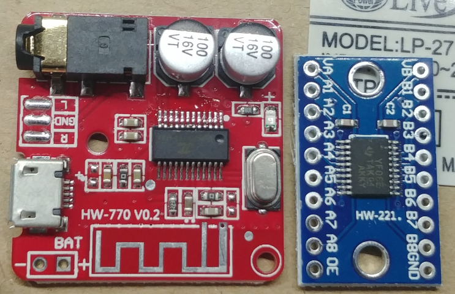
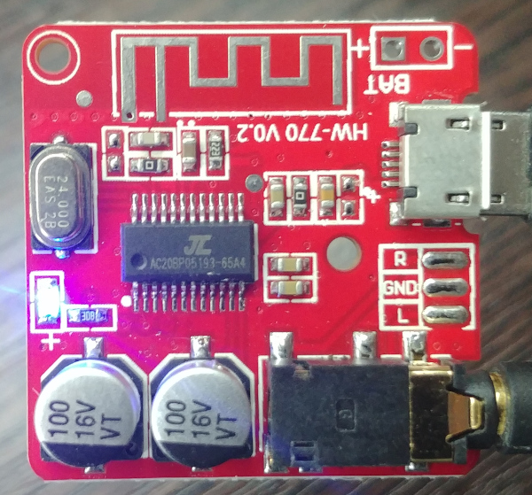
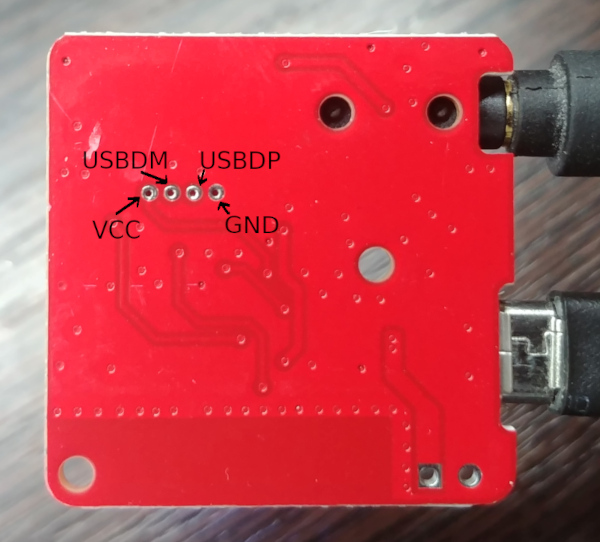

# HW-770 V0.2

Just an bluetooth audio board like the XY-BT-MINI, etc.

- MCU: AC6965A

## Pin usage

|    Pin    |                    Usage                    |
|-----------|---------------------------------------------|
| PB5       | Onboard LED                                 |
| PC5       | Exposed on a pad on front side              |
| USBDM/PC3 | Exposed on a pad on back side (next to VCC) |
| USBDP     | Exposed on a pad on back side (next to GND) |
