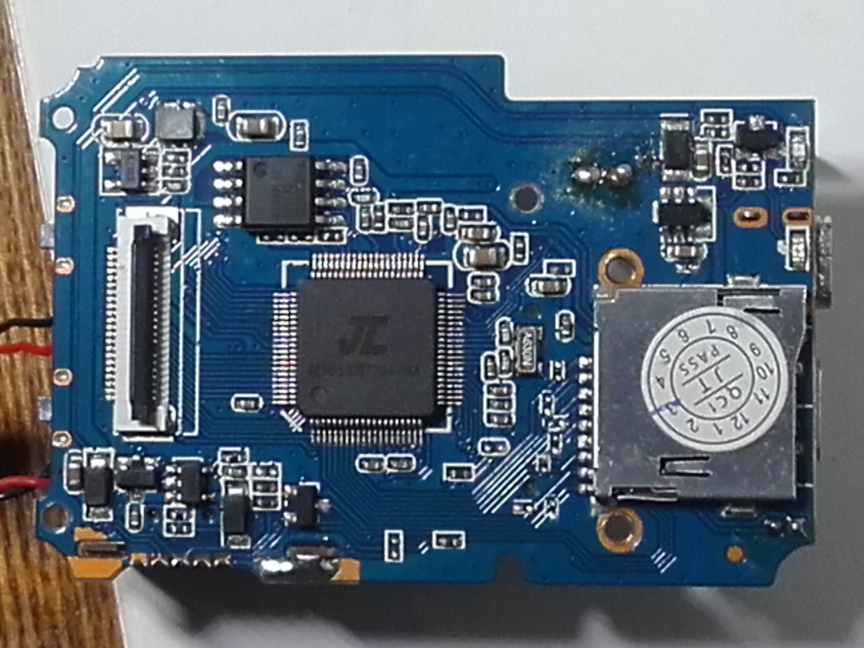
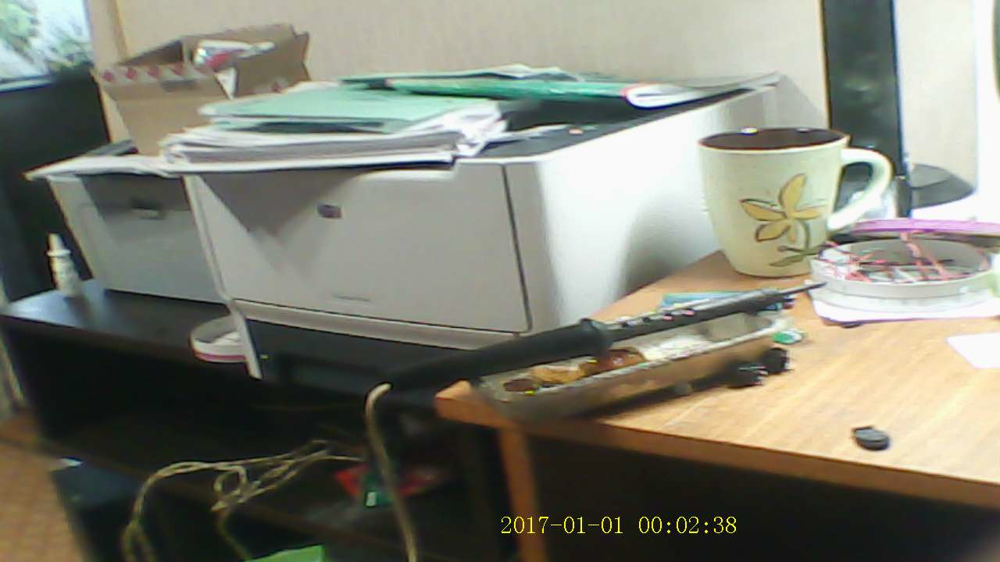
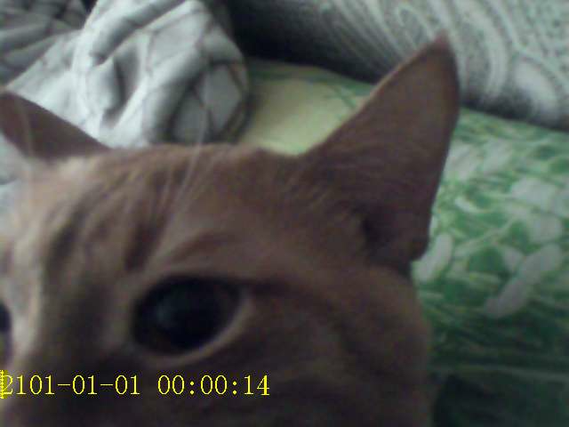
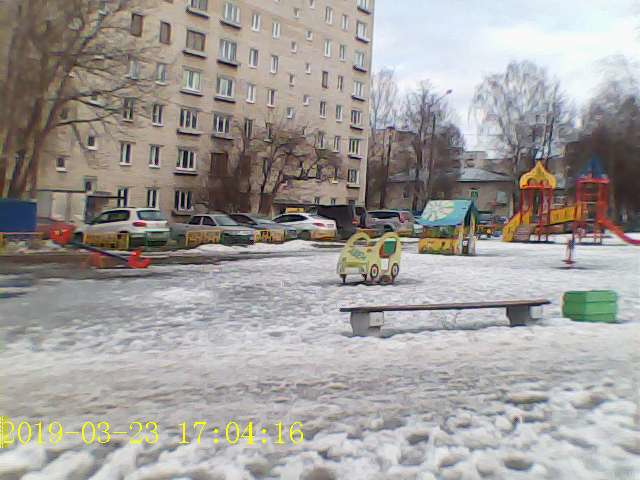

# LS-DV04-B-V1.1

**I don't have this thing anymore... RIP 08.02.2019 - 05.03.2019 - 23.03.2019**

Super Action Dash DV Camera 4K GC0307 sensor camera based on the **JieLi AC5204A**!
I was *really* shocked when i saw that there was an **JIE LI** chip inside!!

- SoC: AC5204A
- Flash: 32 Mbit (4 MiB) SPI flash (in my case, Pm25LQ032)
- Camera: GC0307 (640x480)
- Display: ILI9341(?) TFT display (208x176 iirc)
- Wi-Fi: RTL8189ES

----

# Whatever

Bloat my repo with +1.4 MB worth of pictures!
What's next?
Put all the videos there?!

----

Enjoy this 720p glory!
And that mess...

----

Or this 480p glory?
Yes it was the 2101th year at that time! I'm a time traveller!
Sadly the BAVASIANOS is gone so now i have the ASYA_CAT instead!..

Or no, it isn't even 2101 (twenty-one-oh-one), it's 2901 (twenty-nine-oh-one)!

And before that there was an "twenty-one-nul-nul" year!

----

Rest in peace.
Guess why.

