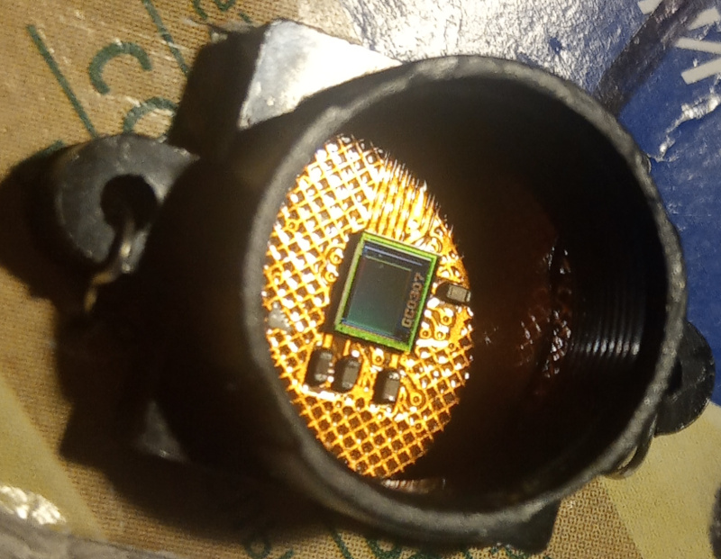
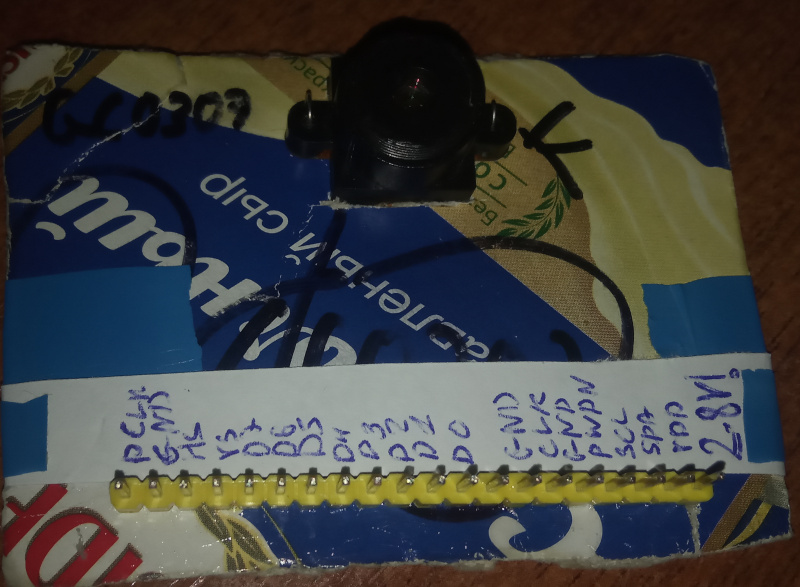

# 4k wifi sports dv cam (LS-DV04-B-V1.1 board)

**I don't have this thing anymore... RIP 08.02.2019 - 05.03.2019 - 23.03.2019**

Super Action Dash DV Camera 4K GC0307 sensor camera based on the **JieLi AC5204A**!
I was *really* shocked when i saw that there was an **JIE LI** chip inside!!

- SoC: [AC5204A](../../chips/dv12/index.md#ac5204a)
- Flash: 32 Mbit (4 MiB) SPI flash (in my case, Pm25LQ032)
- Camera: GC0307 (640x480)
- Display: ILI9341(?) TFT display (~220x176, 208x176 used)
- Wi-Fi: RTL8189ES

## The Sensor

The image sensor that was used in it is the GalaxyCore's GC0307.
It has an resolution of **640x480**. Yeah.... That's the 4K quality we want!

...TODO describe all the story...

Pinout: (labels as per GC0307 datasheet)

|  # | Name   |  # | Name   |  # | Name   |  # | Name   |  # | Name   |  # | Name   |  # | Name   |  # | Name   |
|----|--------|----|--------|----|--------|----|--------|----|--------|----|--------|----|--------|----|--------|
|  1 | PCLK   |  2 | GND    |  3 | HSYNC  |  4 | VSYNC  |  5 | D7     |  6 | D6     |  7 | D5     |  8 | D4     |
|  9 | D3     | 10 | D2     | 11 | D1     | 12 | D0     | 13 |        | 14 |        | 15 | GND    | 16 | IN_CLK |
| 17 | GND    | 18 | PWDN   | 19 |        | 20 | SBCL   | 21 | SBDA   | 22 |        | 23 | VDD    | 24 |        |

--------------------------------------------------------------------------------------------

