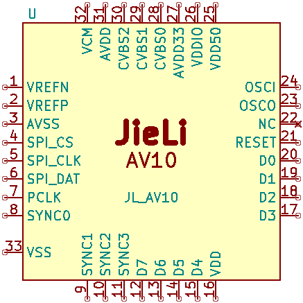

# AV10

CVBS video decoder chip.. to replace the GM7150 (or TVP5150 or any other non-in-house design)
in the car dash cams where it is used to interface the rear camera

- 3 input channels
- PAL/NTSC (and other similar standards too i guess)
- BT.656 and maybe plain YUV422 output too (with discrete syncs)
- Half-duplex ("3-wire") SPI interface

## Pinout

- Package: QFN32

## Stuff

### SPI control bus

Physical interface consists of three signals: CS, CLK and DAT.
The CS is the chip select, which is active low.
DAT is the bidirectional data signal, which is sampled or updated on the CLK's rising edge.

The protocol itself is consistent with other JieLi's SPI-based stuff like IRTC or P33.

Each packet consists of exactly 4 bytes (32 bits):
- `CccccccA|aaaaaaaa|Iiiiiiii|Ooooooooo`
- Ccccccc: Command code
  * 0x01 = Write
  * 0x02 = Read
  * 0x03 = Reset
- Aaaaaaaaa: Address (9-bit)
  * 0x000-0x0FF is the core registers
  * 0x100-0x1FF is the CVD registers
- Iiiiiiii: Input data
  * Valid for 'Write' command, and seemingly for 'Reset' command too.
  * Otherwise it's stuff bits
- Oooooooo: Output data
  * Valid for 'Read' command.
  * Otherwise it's stuff bits

### Registers

( TODO )
