# Pinout diagrams

Global TODO: describe all the alt functions too.

## AC690N

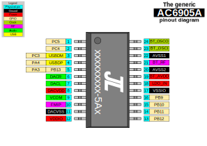

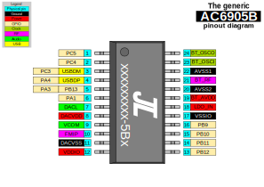

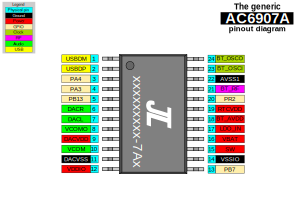

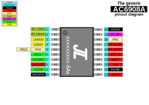

## AC692N

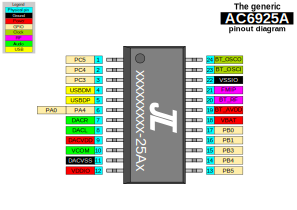

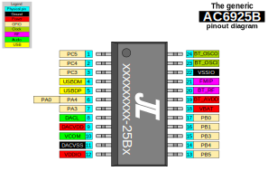

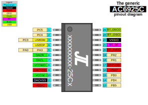

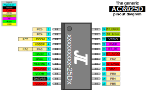

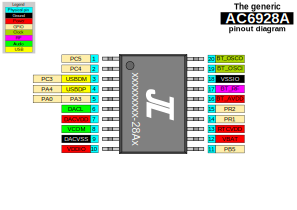

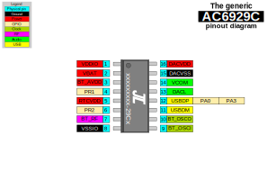

## AC696N

----

## AC109N

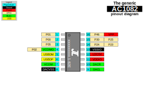

## AC1187

**NOTE** this is merely a guess, don't trust it.

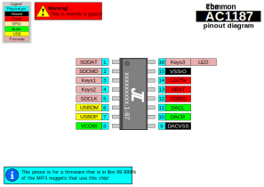
