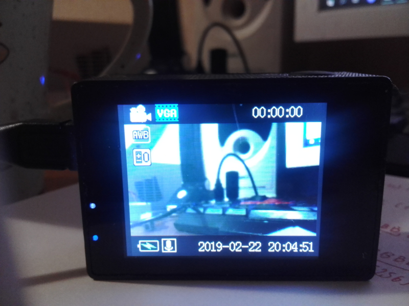
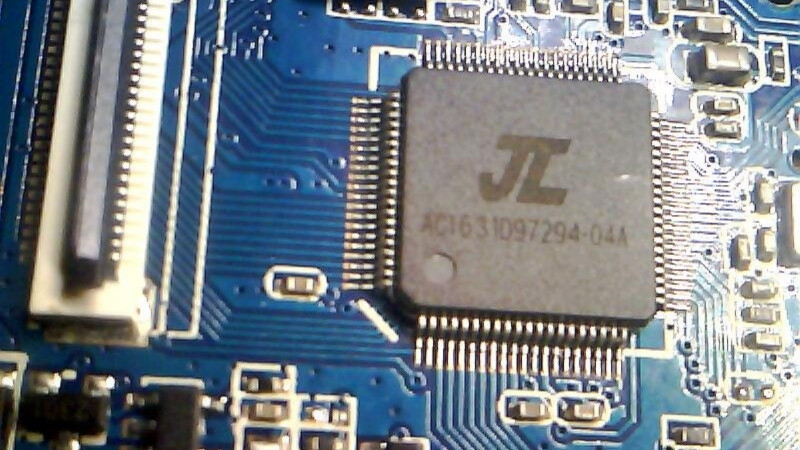
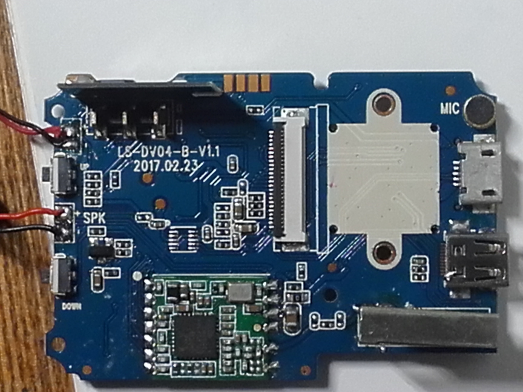

# 4k wifi sports dv cam (LS-DV04-B-V1.1 board)

A cheapo Wi-Fi-enabled "action camera" with a misadvertised 4K recording capability (even in 4K setting it does 1080p and even then the sensor itself is just 480p so that doesn't make much sense).

- SoC: [AC5204A](../../chips/dv12/index.md#ac5204a)
- SPI flash: 32 Mbit (4 MiB) (in my case, Pm25LQ032)
- Sensor: Galaxycore GC0307 (640x480) - the right choice for the 4K camera!!
- Display: ILI9488(?) TFT display (220x176, only 208x176 is used)
- Wi-Fi: Realtek RTL8189ES
- External display: A micro-HDMI connector that is simply left floating (so it's fake)
- USB: Charging only, Mass storage device or USB Video & Audio class.

